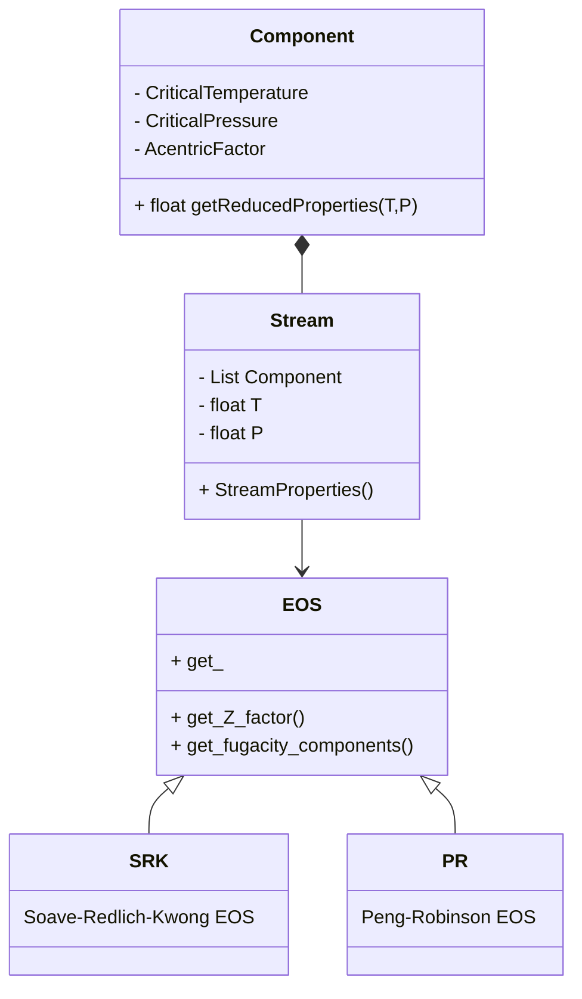

# Exergy calculations
This repository is intended for calculating exergy of streams of components given temperature, pressure, and thermodynamical properties of components.

## Proposed structure

```mermaid
classDiagram

class EOS {
+ get_Z_factor()
+ get_fugacity_components()
+ get_
}

class SRK {
Soave-Redlich-Kwong EOS
}
class PR {
Peng-Robinson EOS
}

class Component {
- CriticalTemperature
- CriticalPressure
- AcentricFactor
+ float getReducedProperties(T,P)
}

class Stream {
- List Component
- float T
- float P
+ StreamProperties()
}

Component *--Stream
EOS<|--SRK
EOS<|--PR
Stream-->EOS

```
